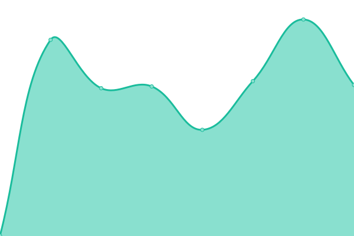

# [📈 Live Status](https://galone.github.io/coim): <!--live status--> **🟩 All systems operational**

This repository contains the open-source uptime monitor and status page for [Gaston Feil](https://galone.github.io/coim), powered by [Upptime](https://github.com/upptime/upptime).

With [Upptime](https://upptime.js.org), you can get your own unlimited and free uptime monitor and status page, powered entirely by a GitHub repository. We use [Issues](https://github.com/galone/coim/issues) as incident reports, [Actions](https://github.com/galone/coim/actions) as uptime monitors, and [Pages](https://galone.github.io/coim) for the status page.

<!--start: status pages-->
<!-- This summary is generated by Upptime (https://github.com/upptime/upptime) -->
<!-- Do not edit this manually, your changes will be overwritten -->
<!-- prettier-ignore -->
| URL | Status | History | Response Time | Uptime |
| --- | ------ | ------- | ------------- | ------ |
|  [CDP](https://ofertaideal.movistar.com.ar/intelligent_campaign) | 🟩 Up | [cdp.yml](https://github.com/galone/coim/commits/HEAD/history/cdp.yml) | 

 2820ms
     
 | 

<a href="https://galone.github.io/coim/history/cdp">100.00%</a>
    

|  [Migra](https://ofertaideal.movistar.com.ar/migraspositivas) | 🟩 Up | [migra.yml](https://github.com/galone/coim/commits/HEAD/history/migra.yml) | 

 883ms
     
 | 

<a href="https://galone.github.io/coim/history/migra">100.00%</a>
    

|  [Migra72](https://ofertaideal.movistar.com.ar/migraspositivas?planID=72) | 🟩 Up | [migra72.yml](https://github.com/galone/coim/commits/HEAD/history/migra72.yml) | 

 563ms
     
 | 

<a href="https://galone.github.io/coim/history/migra72">100.00%</a>
    

|  [WebMultitramite](https://activatuchip.movistar.com.ar/) | 🟩 Up | [web-multitramite.yml](https://github.com/galone/coim/commits/HEAD/history/web-multitramite.yml) | 

 1874ms
     
 | 

<a href="https://galone.github.io/coim/history/web-multitramite">97.38%</a>
    

|  [ReporteAccount](https://exportaccount.herokuapp.com/) | 🟩 Up | [reporte-account.yml](https://github.com/galone/coim/commits/HEAD/history/reporte-account.yml) | 

 118ms
     
 | 

<a href="https://galone.github.io/coim/history/reporte-account">100.00%</a>
    

<!--end: status pages-->

[**Visit our status website →**](https://galone.github.io/coim)

## 📄 License

- Powered by: [Upptime](https://github.com/upptime/upptime)
- Code: [MIT](./LICENSE) © [Gaston Feil](https://galone.github.io/coim)
- Data in the `./history` directory: [Open Database License](https://opendatacommons.org/licenses/odbl/1-0/)
